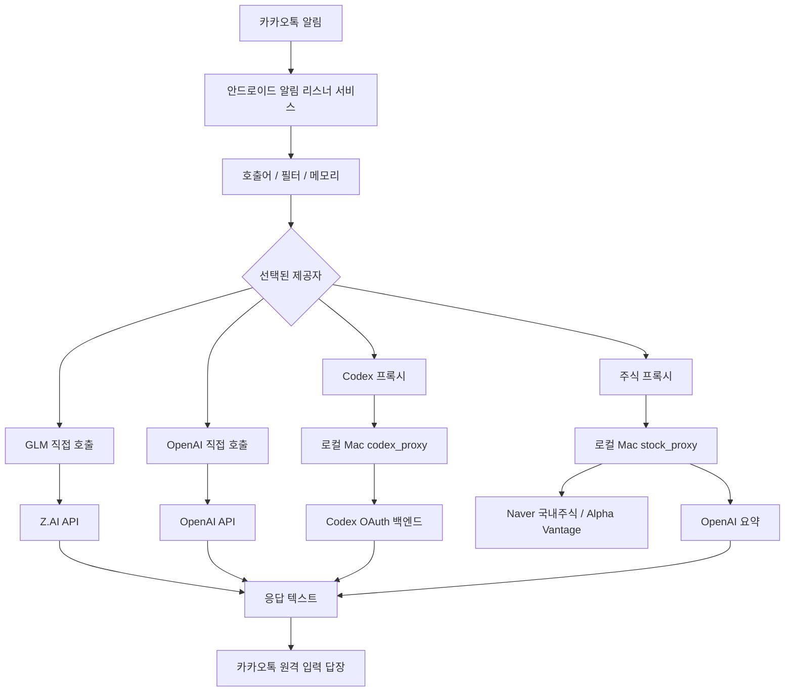

<div align="center">

  
# 카카오 챗봇 (V2 Android 자체 버전 + Proxy 확장)

<p align="center">
  
  
  
</p>

<p align="center">
  <em>Android Standalone without Server, 카카오톡 알림 자동응답, 직접 LLM 호출, Codex OAuth 프록시, 국내 주식 자연어 요약까지 하나로 묶은 안드로이드 중심 프로젝트</em>
</p>

---

</div>

## 📋 프로젝트 개요

이 프로젝트는 **안드로이드 앱이 카카오톡 알림을 직접 수신하고**, 호출어 `코비서`가 포함된 메시지에 대해 선택된 LLM 경로로 질의를 보내 **자동 응답을 생성한 뒤 카카오톡 답장 액션으로 회신하는 구조**입니다.

현재 런타임에서는 아래 4가지 제공자 경로를 지원합니다.

- `GLM`
  안드로이드 앱이 Z.AI GLM API를 직접 호출합니다.
- `OpenAI`
  안드로이드 앱이 OpenAI API를 직접 호출합니다.
- `Codex Proxy`
  안드로이드 앱이 로컬 Mac에서 실행 중인 `codex_proxy`를 통해 Codex OAuth 백엔드에 접근합니다.
- `Stock Proxy`
  안드로이드 앱이 로컬 Mac에서 실행 중인 `stock_proxy`를 통해 국내/글로벌 주식 데이터를 가져오고 OpenAI로 요약합니다.

## ✅ 현재 상태

- [x] 안드로이드 앱이 메인 실행 표면이다
- [x] GLM 직접 호출 제공자 동작
- [x] OpenAI 직접 호출 제공자 동작
- [x] Codex Proxy 제공자 동작
- [x] Stock Proxy 제공자 동작
- [x] 국내 주식 자연어 파싱 동작
- [x] 한국 주식시장 요약 동작
- [x] 섹터 요약 동작
- [x] 2종목 비교 요약 동작
- [x] `StockProxy -> OpenAI` 자동 대체 동작
- [ ] 장기 운영용 실행 가이드는 아직 별도 정리 전
- [ ] Codex Proxy는 여전히 호스트 의존 구조

## 🏗️ 아키텍처



## 📁 저장소 구조

```text
.
├── android_client/        # 안드로이드 앱
├── stock_proxy/           # 주식 데이터 + OpenAI 요약 프록시
├── codex_proxy/           # Codex OAuth 프록시
├── ref/                   # 읽기 전용 레거시 참조
├── AGENTS.md              # 작업 규칙
├── IMPLEMENTATION_CHECKLIST.md
├── STOCK_PROXY_PLAN.md
└── CODEX_PROXY_PLAN.md
```

## 🔒 작업 규칙

이 저장소에서 작업할 때는 아래 규칙을 먼저 봐야 합니다.

- `ref/` 는 읽기 전용
- 활성 구현은 `ref/` 밖에서만 진행

상세 규칙은 [AGENTS.md](./AGENTS.md)를 기준으로 합니다.

## ✨ 주요 기능

### 안드로이드 앱

- 카카오톡 알림 리스너 기반 자동응답
- 호출어 `코비서` 기반 활성화
- 방 단위 인메모리 대화 문맥 유지
- 터미널 스타일 모니터링 UI
- 실시간 제공자 전환
- 응답 대상 모드 전환
- JNI 기반 내장 시크릿 로딩 경로
- 디버그/후킹/루팅 흔적에 대한 기본 보안 가드

### 주식 프록시

- Alpha Vantage 기반 글로벌 주식 조회
- Naver 공개 엔드포인트 기반 국내 주식 조회
- 한국 주식시장 전체 요약
- 국내 종목 자연어 질의 파싱
- 별칭 기반 종목 매핑
- 사전 정의 기반 섹터 요약
- 2종목 비교 요약
- 애매한 주식 질의에 대한 확인 요청 응답

### 코덱스 프록시

- 로컬 호스트의 Codex OAuth 상태 로드
- 토큰 갱신 처리
- Codex 백엔드 직접 호출
- 안드로이드 제공자가 사용할 수 있는 단순 HTTP 인터페이스 제공

## 📊 제공자 비교

| 제공자 | 실행 위치 | 상위 서비스 | 폰 단독 가능 | 비고 |
|---|---|---|---|---|
| `GLM` | Android | Z.AI GLM | 가능 | 기본 직접 호출 경로 |
| `OpenAI` | Android | OpenAI API | 가능 | 모델 전환 가능 |
| `Codex Proxy` | Mac + Android | Codex OAuth 백엔드 | 불가 | 호스트 로그인 상태 필요 |
| `Stock Proxy` | Mac + Android | Naver / Alpha Vantage / OpenAI | 불가 | 근거 기반 주식 요약 용도 |

## 📈 주식 질의 기능

### 지원 예시

- `코비서 삼성전자 최근 흐름 요약해줘`
- `코비서 삼성전자 금일 통향 정리 해줘`
- `코비서 하닉 오늘 어때`
- `코비서 금일 한국주식시장 정리 해줘`
- `코비서 반도체주 오늘 어때`
- `코비서 삼성전자랑 하닉 비교해줘`

### 현재 동작 방식

- 한국 시장 전체 질문 -> 시장 요약 처리
- 단일 종목 질문 -> 종목 요약 처리
- 섹터 질문 -> 사전 정의 섹터 요약 처리
- 2종목 질문 -> 비교 요약 처리
- 애매한 금융성 질문 -> 확인 요청 응답
- `Stock Proxy` 선택 상태의 비주식 질문 -> 안드로이드 쪽에서 `OpenAI`로 자동 대체

### 현재 한계

- 섹터 범위는 사전 정의 기반
- 비교는 2종목까지만 지원
- ETF / 테마 / 매크로 자산은 미지원
- 미국 주식의 자연어 섹터/비교 질의는 아직 미구현

## 🚀 빠른 시작

### 1. 안드로이드 앱 준비

- Android SDK 설치
- USB 디버깅이 켜진 Android 기기 연결
- 기기에 KakaoTalk 설치
- 앱에 알림 리스너 권한 부여

### 2. 안드로이드 로컬 시크릿 준비

```bash
cd android_client
cp secrets.properties.example secrets.properties
```

`secrets.properties` 는 로컬 전용이며 git에 커밋하지 않습니다.

### 3. 주식 프록시 환경 변수

`stock_proxy/.env.local`:

```env
ALPHA_VANTAGE_API_KEY=your_alpha_vantage_key
OPENAI_API_KEY=your_openai_key
OPENAI_MODEL=gpt-5.4
```

### 4. 로컬 프록시 실행

#### stock_proxy

```bash
cd stock_proxy
npm install
npm run dev
```

기본 주소:

- `http://127.0.0.1:4327`

#### codex_proxy

```bash
cd codex_proxy
npm install
npm run dev
```

기본 주소:

- `http://127.0.0.1:4317`

Codex Proxy는 보통 아래 OAuth 상태 파일에 의존합니다.

- `~/.codex/auth.json`

### 5. 안드로이드와 로컬 프록시 연결

```bash
adb reverse tcp:4327 tcp:4327
adb reverse tcp:4317 tcp:4317
adb reverse --list
```

USB 재연결이나 `adbd` 재시작 후에는 다시 실행해야 할 수 있습니다.

### 6. 안드로이드 빌드 및 설치

```bash
cd android_client
./gradlew testDebugUnitTest
./gradlew assembleRelease
adb install -r app/build/outputs/apk/release/app-release.apk
```

### 7. 앱 실행

```bash
adb shell am start -n com.coreline.cbot/.presentation.view.MainActivity
```

그 다음:

1. 알림 권한 허용
2. 제공자 선택
3. 앱을 백그라운드에서 유지
4. 다른 계정/기기에서 카카오톡 메시지로 테스트

## 📱 안드로이드 런타임 메모

### 호출어

`코비서`로 시작하는 메시지만 처리합니다.

예:

- `코비서 하이`
- `코비서 삼성전자 최근 흐름 요약해줘`

### 주식 프록시 자동 대체

선택된 제공자가 `Stock Proxy`일 때:

- 주식/시장성 질문 -> `stock_proxy`
- 비주식 질문 -> 직접 `OpenAI`
- 주식성 질문이지만 프록시 오류 -> 직접 `OpenAI`

### 모니터링 UI

터미널 스타일 UI에서 아래 항목을 볼 수 있습니다.

- 현재 제공자
- 현재 모델
- 응답 모드
- 마지막 지연시간
- 마지막 요청 ID
- 마지막 종료 이유
- 토큰 사용량
- 실시간 로그

## 📡 프록시 HTTP 요약

### stock_proxy

주요 엔드포인트:

- `GET /health`
- `GET /api/v1/providers`
- `POST /api/v1/summary`
- `POST /api/v1/parse-query`
- `POST /api/v1/self-test`

예:

```bash
curl -s -X POST 'http://127.0.0.1:4327/api/v1/parse-query' \
  -H 'content-type: application/json' \
  -d '{"symbol":"하닉 오늘 어때","question":"하닉 오늘 어때"}'

curl -s -X POST 'http://127.0.0.1:4327/api/v1/summary' \
  -H 'content-type: application/json' \
  -d '{"symbol":"반도체주 오늘 어때","question":"반도체주 오늘 어때","includeNews":true,"candlePoints":5}'

curl -s -X POST 'http://127.0.0.1:4327/api/v1/summary' \
  -H 'content-type: application/json' \
  -d '{"symbol":"삼성전자랑 하닉 비교해줘","question":"삼성전자랑 하닉 비교해줘","includeNews":true,"candlePoints":5}'
```

### codex_proxy

주요 엔드포인트:

- `GET /health`
- `GET /api/v1/auth/status`
- `GET /api/v1/providers`
- `POST /api/v1/chat`
- `POST /api/v1/self-test`

예:

```bash
curl -s http://127.0.0.1:4317/api/v1/chat \
  -H 'content-type: application/json' \
  -d '{"prompt":"Say hi in Korean."}'
```

## 🔐 보안 메모

- `ref/`는 참조 전용
- Android 앱 키는 Kotlin 소스에 직접 넣지 않음
- 내장 시크릿은 강한 비밀 저장소가 아니라 추출 난이도 상승용 난독화 방식
- `Codex Proxy`는 로컬 호스트의 OAuth 상태에 의존
- `Stock Proxy`, `Codex Proxy`는 현재 로컬/개인 운영 성격의 프록시

## ⚠️ 현재 제약사항

- 장기 운영용 실행 가이드 없음
- CI / 배포 자동화 문서 없음
- Android와 로컬 프록시 사이 인증 계층 없음
- LAN / 공개 네트워크 하드닝 없음
- 섹터 사전 수가 아직 적음
- 3종목 이상 비교 미지원
- 확인 요청 응답을 Android UI에서 대화형으로 재질문하는 흐름 없음

## 📚 관련 문서

- [AGENTS.md](./AGENTS.md)
- [IMPLEMENTATION_CHECKLIST.md](./IMPLEMENTATION_CHECKLIST.md)
- [STOCK_PROXY_PLAN.md](./STOCK_PROXY_PLAN.md)
- [CODEX_PROXY_PLAN.md](./CODEX_PROXY_PLAN.md)
- [stock_proxy/README.md](./stock_proxy/README.md)
- [codex_proxy/README.md](./codex_proxy/README.md)

## 🧭 참조 전용 레거시

아래는 활성 구현 대상이 아닙니다.

- [ref/README.md](./ref/README.md)
- `ref/`
